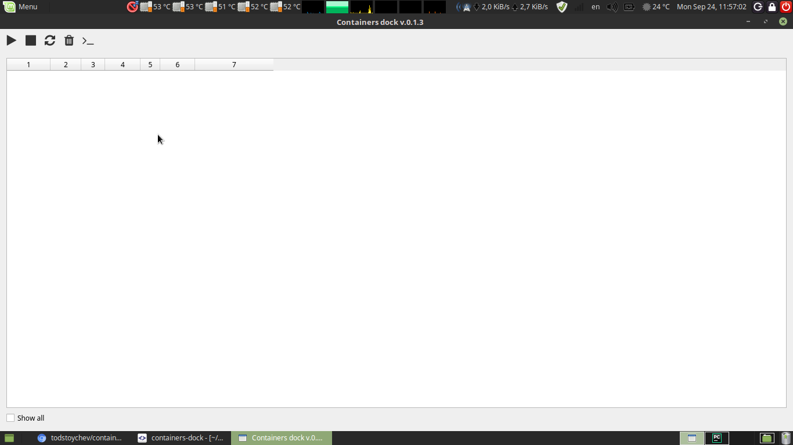
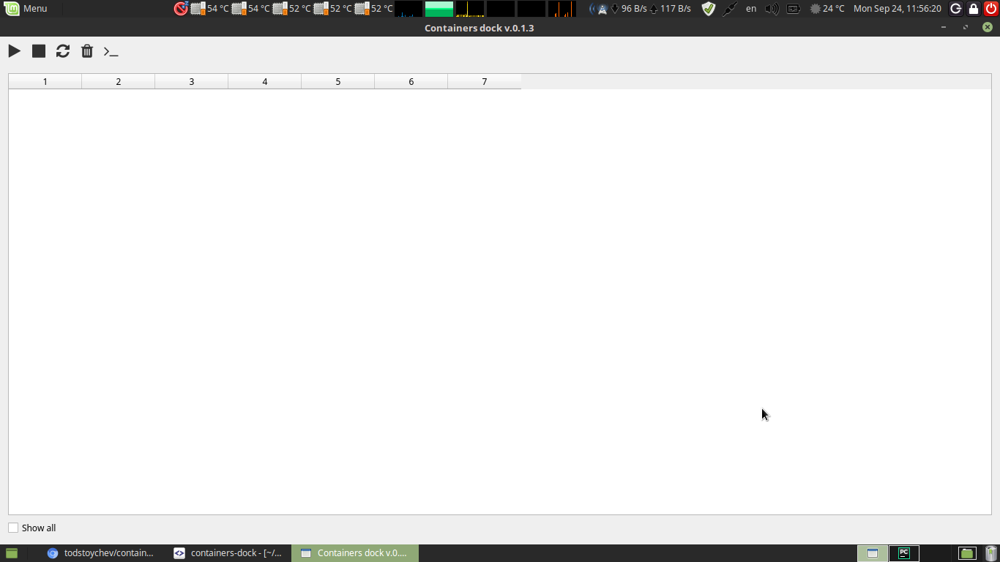
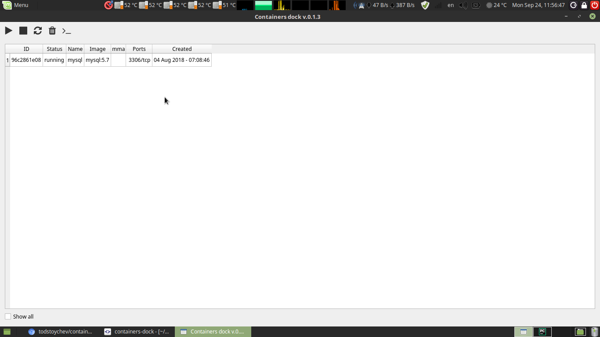

# Introduction
This application is used to be a simple interface to manipulate docker containers in local environment.

# Installation
Use ```pip3 install containers-dock``` to install the application as Python3 module.

# Usage
## As standalone app
Call it for the console using ```containers-dock```. executing the command must result in application GUI to start. 
Screenshots:






## As API
If you want to use the GUI in another application, use:

```python
from containers_dock.app import App

app = App()
app.run() 

```
